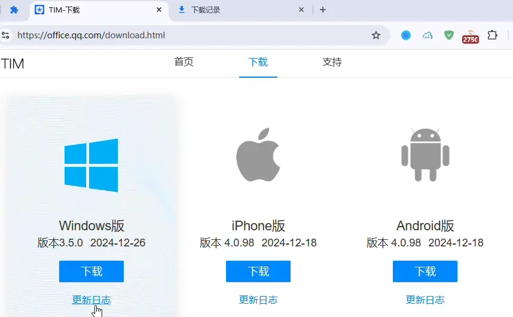

# Elegant Download Indicator

This is a Chrome extension demo which could render animations at extension icon dynamically.

## Features

- Indicate downloading status via icon animation
- Extension Icon transition animation
- Animation fade out effect
- Extension icon management

## Development

The animation is implemented by javascript canvas 2d API.

You could write your own icon animation by extending **BaseAnimation** and implement the **render** function at `Animation.js`.

Tune the constants at `Constants.js`.

## Todo

- Support rendering image resource to canvas

## Test

Download and save a file from web

## Screenshot

## License

This demo is licensed under BSD 3-Clause License.